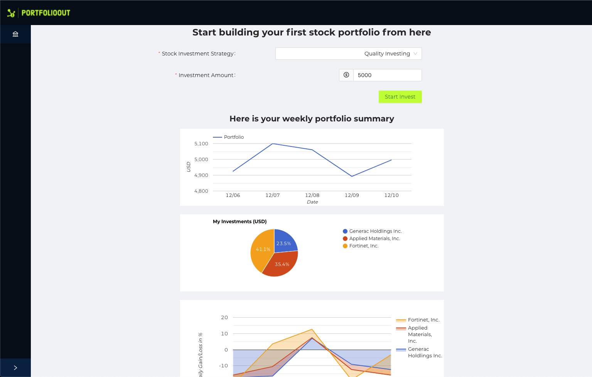

# CMPE285-portfolioout

## Description:
This project provides a stock portfolio suggestion engine for the user.

## User will:
Input dollar amount to invest in USD (Minimum is $5000 USD)

Pick one investment strategies:
- Ethical Investing
- Growth Investing
- Index Investing
- Quality Investing
- Value Investing

The engine needs to assign stocks or ETFs for a selected investment strategy. E.g.

## Output:
The suggestion engine will output:

Which stocks are selected based on inputed strategies.
How the money are divided to buy the suggested stock.
The current values (up to the sec via Internet) of the overall portfolio (including all the stocks / ETFs)
A weekly trend of the portfolio value. In order words, keep 5 days history of the overall portfolio value.